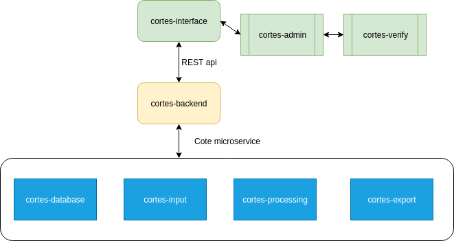

# cortes
Côrtes, a moderm document processing platform

The main function of the Cortes platform is the extract data from the documents and classify with the given rules.

## Modules

The Cortes platform is divides in modules as below

---

### cortes-interface

the user interface for the cortes software, its is to composition of the cortes-admin and the cortes-verify modules

#### cortes-admin

admin is the module where the user can configure the software to process the documents

#### cortes-verify

verify is the quality control module of the software. Here its possible to check the processing result and
execute any ajustments needed

---

#### cortes-backend

the comunication point between the user interface ui and the runtime modules of the cortes modules

#### cortes-input

input is the module that will be the input of documents into the software

#### cortes-processing

processing will read the configurations, read the inputs and process the documents acording with the configurations

the processing steps can be data extraction, classification, modification of the input documents

#### cortes-export

export is the final processing point of the documents in the system. Here the documents and the metadate generated at the
processing and/or verify time are exported from the software

#### cortes-database

the layer to acess the database configuration and runtime data of cortes software

---

## The modules diagram

